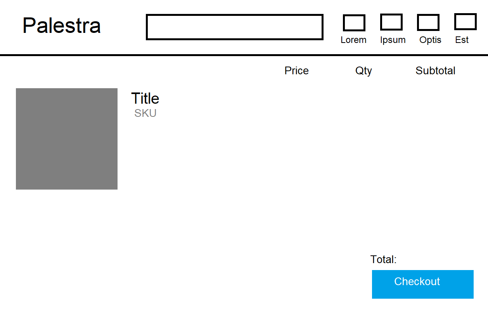
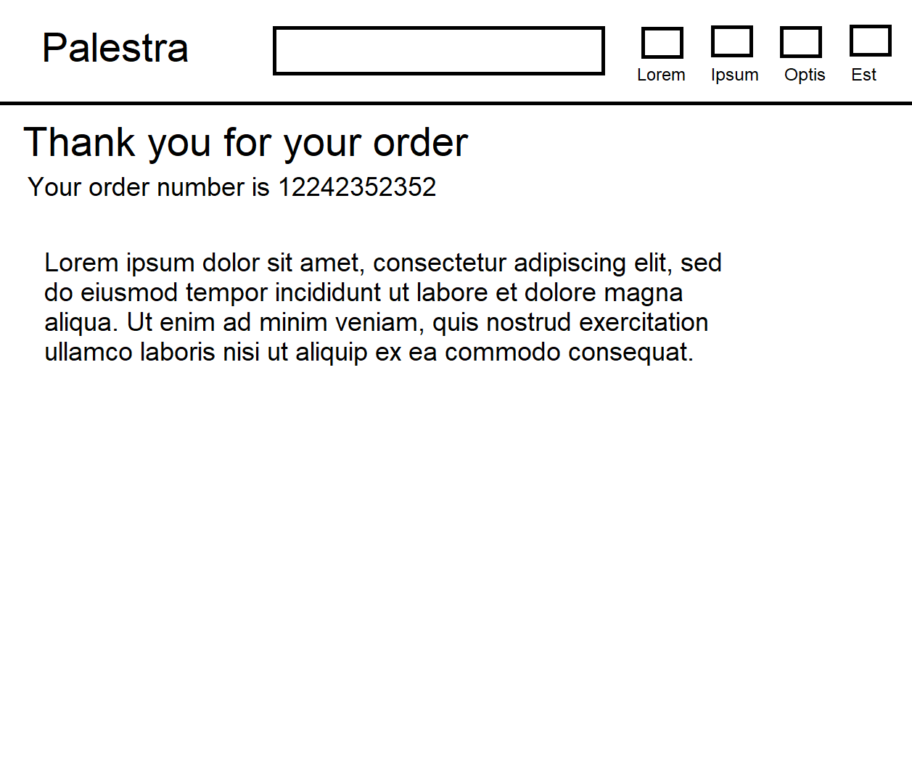

# Milestone 4

This site (Palestra Fitness) is to be a fitness themed site that offers products for sale, and places for people to connect over the common interest of fitness. The focus will be on a shop with nutritional/plan subscriptions and a blog and a strong user interactivity.

## User Stories

### External user’s goal:

1. As an external user, I want to be able to purchase products, and post on the site so that I can become part of a fitness community.

2. As an external user, I want easy access to a wide range of fitness related merchandise and goods so that they can be utilised.

3. As an external user, I want strong features with a draw to keep coming back to, so that the site will be a more welcoming and engaging site on which to be on.

4. As an external user, I want the ability to buy subscriptions in the store so that I can get a consistent use of a product that I enjoy.

### Site owner's goal:

1. As a site owner, I want to build an active community around the product based on
subscription and individual payments models so that people continue returning to the site.

2. As a site owner, I want to sell products so that the site can begin to make profit.

3. As a site owner, I want to sell exercise plans so that the site's users can access specialised fitness content.

4. As a site owner, I want to sell nutrition plans so that the users of the site can supplement their exercise plans.

5. As a site owner, I want to sell nutrition and exercise products so that the site is able to draw a profit and cultivate returning users.

## Wireframes

### Desktop Home

### Mobile Home

### Login

### Mobile Login

### Signup

### Signup Mobile

### Profile

### Mobile Profile 

### Blog

### Mobile Blog

### Blog Specific Post

### Mobile Blog Specific Post

### Shop

### Shop Mobile

### Product View

### Product View Mobile

### Empty Bag

### Empty Bag Mobile

### Bag

### Bag Mobile

### Checkout

### Checkout Mobile

### Order Confirmation

### Order Confirmation Mobile

## Database Layout

### Blog Database

### Checkout Database

### Profile Database

### Shop Database

### JSON Product Categories

## Design

* Roboto by google fonts was chosen due to its strong, industrial appearance, being suitable to a gym website

* Icons from fontawesome will be used to create a more user friendly and aesthetically pleasing appearance

* Colours will be blue and white predominantly, due to being in strong association with fitness and health.

* General styling will lean towards being readable and easy to navigate at all times for the user.

## Technologies used

### Gitpod
* The version control on Gitpod was used to create commits and version control the project and was used as the primary IDE for the project.

### Github
* Github was used to store all versions committed from Gitpod and to manage the Gitpod account.

### Heroku
* Heroku was used to create an app and make the website live, linking to gitpod and allowing the use of automatic deployments when a commit is made from gitpod.

### Postgres
* Postgres within Heroku will be used to store the database of the project, and all of its information.

### Amazon web services
* The amazon web services will be used to store all images related to the project. It is accessible by superusers to add and delete images.

### Django
* Django was used as the basis of the project and its technologies make up the backbone of the entire project. A lot of its other technologies
* Django's countries, crispy-forms, allauth, countries, mathfilters and others were used within the framework to create forms, add logins, add a country list and to change the appearance of numbers and dates within the site.

### dj-database-url and boto3
* Both were used in the process of initalising the deployment of the project to heroku and for the use of postgres.

### gunicorn
* gunicorn was used to connect the procfile to heroku and ensure the deployment went smoothly.

### Favicon.cc
* This site was used to make the favicon for the site.

### Google Chrome Development Tools
* Used heavily to test site responsiveness across many different screen sizes, and to inspect any possible layout irregularities with its ability to examine code line by line, and add or remove in the environment to see how it displays.

## Features

### Base Features
* A nav bar that changes between desktop and mobile versions and allows smooth navigation through the site. Within the mobile version, the navbar dropdown menu features the product categories, to provide a cleaner user experience when using the shop on a mobile device.

* A search function to browse the store on the site is present on the html template, meaning quick access to a user is available at all points on the site.

### Home Page
* A scrolling image with a display in the middle informing users of different featured items on the site that changes every 5 seconds, enticing a user to explore the site.

### Shop
* A clean layout, with all the products displayed clearly, changing the number per row on desktop and mobile (from 3 on a large screen to 1 in a row on a small screen). On desktop, the selection to explore item categories is displayed on the left of the screen. Each item on display has its name, price, rating and category displayed within its div. When logged in as a superuser on the site, the edit and delete options are also displayed.

* The ability to sort items by price, category and rating are implemented and displayed at the top of the shop page.

* When viewing a product, a user can add a review, or a simple rating and see previous reviews.

* On the product view page, the user can add the item to the bag.

* For products with no, or a missing image, a default image is loaded in place to prevent the layout of the page from being disrupted.

### Blog
* The add post form is available to the user at the very top of the page.

* A section for recent posts is below the add post form, and has all posts recently added to the site listed with an option to click on the title and see the post and its comments in detail.

* A user can comment on a specific post, and the comments will appear under the aformentioned post.

### Bag
* The user can see what items they have added to the bag, and delete them within the bag.

### Checkout
* The checkout page has the products the user has added to the bag displayed.

* The credit card and details are placed under the bag list, and there is also an option to save the shipping information submitted to the user's profile if they are logged in.

* If the user is logged in, the information they have saved to their profile is automatically loaded into the shipping information section during checkout.

### Profile
* A signed in user can see their previous orders saved to the profile, and have the option to view and update shipping information.

### Signup/Login
* The site permits the use of creating a user, using an email confirmation to allow the use of the profile. 

### Superuser
* A superuser has the option to add and delete products within the site itself, with changes taking place instantly.

* The superuser also has the option to edit a product, with a preview image within the editing page to see the previous product image.

## Testing

### User Story Testing

#### External user

1. Joining a community was made very possible by the ability to join forums, comment and post.

2. The shop is the most prominent part of the site arguably and very accessible to all users.

3. Very strong features that make coming back to the site, for any number of different uses, very tempting to a user and creates a good sense of variety.

4. Subscriptions and their skus are listed on the store where the user can find them very easily.

#### Site owner

1. The community is able to be very active and discuss products readily in the forums.

2. The shop makes selling a wide range of products very simple.

3. The store has an entire section dedicated to exercise plans meaning they can't be missed. And with a prominent advertisement on the homepage.

4. As with the exercise plans, the nutrition plans have their own section and are very much able to be accessed with ease.

5. The other sections of the store dedicated to these types of fitness merchandise are available and featured prominently.

### Validation

The site underwent validation in a number of steps in order to ensure that the HTML was error free and highly functional. Each page followed a number of steps outlined below as to how they were validated.

1. The first step was to place the link into the W3C validator, and see what errors are present. After clearing these, the errors were then cleared and then the next step was commenced.

2. The next part of the html validation was to go into google chrome's developer tools, and click source. After opening the code running behind the page, it was then copied and pasted into the html validators raw input mode. This ensures that the html is being validated, even accounting for any possible variance.

3. The third step is an extension of the second. On a page, for example, the bag or blog for example where the content can vary, using the dev tools source code and checking multiple combinations of variations on each page was very useful. The bag page for instance was tested with multiple different quantities of items, different sizes, and with many different varieties of bag contents to ensure the html was secure and error free.

4. After the validation of the HTML was finished, the CSS was ran through the W3C CSS validator and ran without issue.

5. The views.py contents in each django app were run through the validator on pep8online.com to ensure that the python code was pep8 compliant and well structured. This was in combination with a linter to ensure the content was as of high quality as possible.

### HTML Validation

#### Home Page Validation

#### Login Validation

#### Signup Validation

#### Profile Validation

#### Shop Validation

#### Product View Validation

#### Bag Validation

#### Checkout Validation

For the checkout validation, it was necessary to leave this h1 element empty due to its use as a loading spinner.

#### Order Confirmation Validation

#### Blog Validation

#### Blog Post Validation

#### Product Management Validation

#### Product Edit Validation

### CSS Validation

#### Main CSS Validation

#### Checkout CSS Validation

#### Profile CSS Validation

### Javascript and Python/Django

For Javascript and Python, both were run through a linter and any errors were removed. For python, pep8 compliance was reached by running through validators and ensuring that the code was compliant. 

### Usage Testing

* The website was tested across a large number of different screen sizes to ensure functions all work, and the absence of dead links or any poor layouts. It was assured to be working on many that could not be checked on physical devices using google's dev tools, using 320px as a minimum width to ensure all layouts stay of high quality for.

* 4 devices were used to test the project, two windows computers and two android phones and all functions of the website were perfectly operational. All functions and features of the website were tested on these devices thoroughly and with care to make sure nothing could potentially cause errors specific to mobile for example.

* Usage of every theoretical combination of functions in each order was done to ensure the site has a solid experience no matter how it is used by the user and all worked very well. For example, exiting mid way through payment to go to the blog, posting a review and going to the home page et cetera. In essence, assuring that any possible way a user could use the site is not going to create any errors.

### Bugs Fixed

#### HTML

1. When using the bootstrap template for the mobile header and after interacting with the 
products and accounts sub menus within the mobile navbar, this would close the main navbar.
This was resolved by changing the classes of the navbar and divs containing the nav elements to
be more similar to that of the enclosed navbars. Changed From an anchor element with a class of 
"nav-link" to a nav element with a class of "navbar". This allowed the navbar to remain open.

2. The container classes from bootstrap were applied to the third and fourth elements within the mobile navbar, creating an imbalance within the appearance of the navbar thus requiring the addition of a div with the class of container wrapping the first and second li elements. This added the required classes and fixed the imbalance.

3. The HTML file would be completely unstyled, however this was resolved by adding "" to the base.html to prevent any elements from being unstyled.

4. When connecting the input within the form to the search query the information entered would not be processed and all products would show despite lack of relevance. The problem turned out to be a mismatch between the name searched for by the python search code and the name attribute on the inputs. This was fixed by matching the two.

5. In the view_product.html, the image is normally meant to lead to a product.image.url, however this link was the same even with the noimage.png loaded in the absence of a product image. A fix to this was removing the anchor element around the noimage.png loader, as it is not necessary and can crash the application.

#### CSS

1. After creating the mobile header element, the content from the page would collapse below the header and would prevent reading of the top elements. This was resolved by adding a margin of 40px (the height of the mobile header) to the divs and other main body elements of the page on mobile.

2. The product's title had padding that when it crossed two lines ended up causing major disruption to the layout. A solution was removing the padding and modifying the settings in the css file for its height.

#### Javascript

1. When creating the sliding image mainscreen, the code to check the current "left" alignment of the divs was originally set to detect when left is -100% before being moved to 200% to set the infinite cycle. A problem that occured in testing was that if the container did not go to -100% precisely, it would cycle left indefinitely. This was resolved by setting the code to check for any elements further left than -100%, preventing moving indefinitely, and allowing the cycle to be continued without error.

#### PYTHON/Django

1. When creating the shop model in django, the links were not functioning and the templates were not being reached when there was an attempt to go to the shop template. This was an error in usage of django, requiring the path being added to urls.py.

2. After mistakenly placing the static folder within the palestra app, it was moved outside into the main project folder after failing to be accessed by other apps and this resolved any errors.

3. When creating the filter function in views.py, an empty "categories" variable could be passed to the page when sorting is not present causing an error to occur. A solution to this was setting "categories = None" at the top of the function to prevent this error.

4. During the creation of contexts.py for the bag app, the site would crash when trying to access the bag page. This was due to a variable referenced before assignment. For the sake of simplicity and before the variable can be established elsewhere, it was set to 0 before reference to prevent the site crashing before the grand_total variable can be created elsewhere.

5. When creating the sorting bar for the mobile page, the code would not be read by the if functions as they previously were written . However this proved to be incorrect and changing to  allowed it to function as intended.

6. When creating the bag app there was an issue using the default django template calculations.  in the code originally rounded the subtotal, thus reducing accuracy. The solution was installing mathfilters and changing the code to ${{ item.product.price|mul:item.quantity }}, thus removing the rounding error.

7. When creating the deletion form on the shopping bag, an error occured when trying to delete items of a certain size. Adding a hidden input that would send the product_value was used to resolve the problem. Originally there was an attempt to try use the dictionary key attribute to get the size which did not work.

#### Existing bugs

1. When using the sort items by selector on the shop, it will only sort by all items on the store, not within a subcategory.

## Deployment

Heroku

1. Log into Heroku

2. Click New and then from there Create new app

3. Name the new app then choose the closest region to host it

4. Go to resources, then type "postgres" into the add-ons section and select "Heroku Postgres", and choose a plan

5. back in gitpod, type in pip3 install dj_database_url

6. Then install "pip3 install psycopg2-binary"

7. Add both to requirements.txt

8. After this, import dj_database_url in settings.py   

9. Set DATABASES (also in settings.py) with default as dj_database_url.parse() and get database name from heroku config vars

10. Run migrations again, as it needs to connect to the new database

11. Use loaddata on fixture files to add them to new database

12. Create superuser for app using python3 manage.py create superuser

13. Add if function in settings.py to know where the app is running and such which database to use

14. Install gunicorn to act as a webserver. Don’t forget to freeze into requirements.

15. Create the procfile in order to interact with heroku, tell it to create dynos etc

16. Login to heroku on the terminal using ‘heroku login’

17. In the terminal write “heroku config:set DISABLE_COLLECTSTATIC=1 –app” with an app name at the end, as to prevent heroku from taking static files when deployed

18. Add ALLOWED_HOST in settings.py and set as the heroku app

19. Create a heroku remote to gitpod, with “heroku git:remote -a ” with the app name after

20. Push to the remote master.

21. Set up to automatically deploy from github using herokus connect to github button in the deploy tab. Search for the repo name and then click add.

22. Set up automatic deploys to ensure the code can automatically be pushed from gitpod

23. Get a randomly generated secret key and add to the heroku config vars

24. Set the secret key to come from the environ

### Amazon AWS

1. Set up amazon aws account and create it as a personal account

2. Search for “S3” and click create bucket. Make sure to allow public access

3. Click the name of the bucket and click the properties tab, and select to use this bucket to store a static website. And set it to selected. Fill in some default values for the fields expecting html as these are already elsewhere so will not be needed.

4. Go to permissions, add in code for a CORS configuration.

5. Go to the policy tab and click policy creator to create a policy bucket.

6. Set as S3 bucket policy, all principals set as “*” and action set to getobject

7. Get the amazon resource name and place in previous forms arn form input

### Creating bucket user

1. Open up IAM and create a group

2. Select Groups and create a group with a name relevant to the site 

3. Select Policy then create policy.

4. Go to the json tab and select import managed policy. Import s3 full access

5. Go to bucket policy in s3 and get the arn to add into the policy. Click review policy then give a name, description

6. Go to groups and attach the policy to the created group and click permissions and attach policy. Then click attach policy
Go to users, add user, and give programmatic access. After this attach the user to the group
Download the csv file supplied with access keys

### Connecting django to s3

1. Install boto3 and django-storages

2. Add settings to django to allow it to detect AWS. 

3. Go to heroku and add the keys to the config vars

4. Create a custom_settings.py file and import django settings. Add storage information into this file

5. In settings.py add all the links and relevant parts to connect the files

### Finalising
1. Go into settings and add code to allow caching within the app

2. Go to s3 and create media folder

3. Inside click upload and add files, then select all images

4. Now add the stripe secret keys to heroku

## Credits

### content
* All code written by Stephen Galway

### Acknowlegements
* My mentor Spencer for providing many valuable insights on improving the website and the various 
testers who offered advice to make the website more user friendly. Also to the staff at the tutor support who were a fantastic help throughout the project and provided many hours of assistance and helped with many bugs and issues